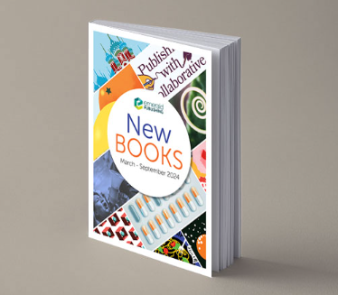

\# Book Catalog Project

The Book Catalog project is a robust, scalable backend application designed to efficiently manage and catalog information for a collection of books. This system leverages modern technology stacks, including Java Spring Boot for rapid API development, MongoDB for flexible and high-performance database storage, Elasticsearch for advanced search capabilities, and Redis for caching to ensure high throughput and low latency.

The primary objective of this project is to create a seamless experience for users interacting with a large catalog of books. The RESTful API, built with Spring Boot, provides endpoints to perform essential operations such as creating, updating, retrieving, and deleting book records. Each book entry contains fields like title, author, ISBN, publication year, and description, allowing comprehensive cataloging and metadata management.

Persistent data storage is handled by MongoDB, offering the benefits of a document-oriented database that scales naturally with growing collections. MongoDB’s flexibility in schema design makes the system adaptable to evolving requirements and additional metadata.

For users needing fast and sophisticated search functionality—such as searching by keywords, author names, or publication details—the integration with Elasticsearch delivers near real-time full-text search and filtering. Elasticsearch empowers the system to support ranked queries, suggestions, and analytics on book data, features often requested in modern catalog-driven applications.

Redis is strategically utilized to cache frequently accessed book and search data, dramatically reducing response times and enabling the application to handle a high volume of simultaneous requests. This ensures users experience efficient and responsive service even under load.

This tech stack not only supports reliable CRUD operations but also provides the foundation for a feature-rich, modern API ready for further enhancements like user authentication, audit logging, and more. The Book Catalog project is an exemplary template for backend developers seeking to master practical integrations of Spring Boot with NoSQL databases, search engines, and caching solutions.

